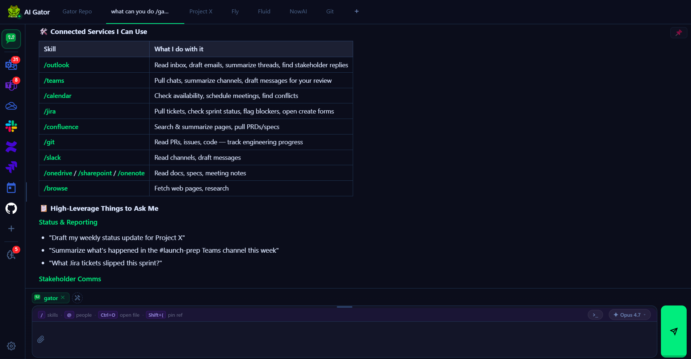

# AI Gator

An AI-powered productivity assistant that lives in your taskbar. Chat with your calendar, email, Teams, files, Confluence, Jira, GitHub, and more — all from one sidebar.



---

## Easy Install (Alpha Testers)

Two ways to install — the one-liner is fastest (no download, no unzip).

### Option 1 — One-line install (recommended)

Open a terminal and paste one line. It fetches the latest version and starts the app. Because it runs the script directly from the web, there's nothing to unblock.

<details open>
<summary><b>PowerShell</b></summary>

```powershell
irm https://raw.githubusercontent.com/mkflyamd/aigator-releases/main/Get-AIGator.ps1 | iex
```
</details>

<details>
<summary><b>Command Prompt / Windows Terminal</b></summary>

```bat
powershell -NoProfile -ExecutionPolicy Bypass -Command "irm https://raw.githubusercontent.com/mkflyamd/aigator-releases/main/Get-AIGator.ps1 | iex"
```
</details>

<details>
<summary><b>macOS (Terminal)</b></summary>

```bash
curl -fsSL https://raw.githubusercontent.com/mkflyamd/aigator-releases/main/Get-AIGator.sh | bash
```

If `curl` is blocked on your machine, use `wget` instead:

```bash
wget -qO- https://raw.githubusercontent.com/mkflyamd/aigator-releases/main/Get-AIGator.sh | bash
```

Installs Python 3.12 via Homebrew if needed, sets up the app in `~/Applications/AIGator`, and opens `http://localhost:8000`. To open it again later, double-click **`start.command`** in that folder. (No system-tray icon on macOS yet — the app runs as a background server.)
</details>

### Option 2 — Download and run

If you'd rather grab the files yourself:

**1. Download the app** — Go to the [project page](https://github.com/mkflyamd/aigator-releases), click the green **Code** button, then **Download ZIP**. Right-click the ZIP and choose **Extract All**.

**2. Run the setup script** — Open a terminal **in the extracted folder**: in File Explorer, click the address bar, type `powershell`, and press Enter. Then paste one line — it unblocks the script and runs it:

<details open>
<summary><b>PowerShell</b></summary>

```powershell
Unblock-File .\WakeGator.ps1; .\WakeGator.ps1
```
</details>

<details>
<summary><b>Command Prompt / Windows Terminal</b></summary>

```bat
powershell -NoProfile -ExecutionPolicy Bypass -Command "Unblock-File '.\WakeGator.ps1'; & '.\WakeGator.ps1'"
```
</details>

> **Prefer clicking?** Right-click **`WakeGator.ps1`** → **Run with PowerShell**. If it's blocked or closes instantly, use the command above instead — some machines don't show the Properties → Unblock option, and corporate Group Policy ignores `-ExecutionPolicy Bypass` on its own. The `Unblock-File` in the command is what actually clears the block.

---

Either way, the setup will:

- Install Python for you if it isn't already on your machine
- Set up everything the app needs (a few minutes the first time)
- Add **AI Gator** to your Start Menu (and, if you choose, your desktop and login startup)
- Start the gator in your system tray

**Open the app:** a browser tab opens automatically at `http://localhost:8000`, and the gator icon appears in your system tray (bottom-right of the taskbar). To open it again later, search **"AI Gator"** in the Start Menu.

You'll need an API key to chat — see [Configuration](#configuration) below.

---

## Quick Start (Developers)

**Requirements:** Python 3.12, Windows 10/11 (full) or macOS (run-from-source)

```bash
git clone https://github.com/mkflyamd/aigator-releases.git
cd aigator-releases
pip install -r web/requirements.txt
```

Configure your API key:

```json
// ~/.config/teamspoc/config.json
{
  "api_key": "sk-ant-...",
  "llm_gateway_url": "https://api.anthropic.com"
}
```

Start the server:

```powershell
web\start.bat
```

Open `http://localhost:8000` in your browser.

---

## Features

- **Chat with your tools** — Outlook, Teams, Calendar, OneDrive, OneNote, SharePoint, Confluence, Jira, GitHub, Slack
- **Skill marketplace** — install community skills from any git repo
- **Browser agent** — automate web tasks via natural language
- **MCP support** — connect any Model Context Protocol server
- **Multi-tab** — run parallel conversations pinned to different contexts
- **Scheduler** — set up recurring tasks and reminders

---

## Configuration

See [docs/gateway-setup.md](docs/gateway-setup.md) for gateway configuration — direct Anthropic or corporate LLM proxy.

See [GETTING_STARTED.md](GETTING_STARTED.md) for full setup walkthrough.

---

## Enterprise Deployment

AI Gator works with any corporate LLM gateway that proxies the Anthropic API. Configure in `~/.config/teamspoc/config.json`:

```json
{
  "api_key": "your-gateway-key",
  "llm_gateway_url": "https://llm.your-company.com/Anthropic",
  "llm_gateway_key_header": "Ocp-Apim-Subscription-Key",
  "llm_gateway_user_field": "user",
  "gateway_user_id": "your-user-id"
}
```

M365 integration requires an Azure AD app registration with the permissions listed in [GETTING_STARTED.md](GETTING_STARTED.md).

For building a Windows installer, see [BUILD_INSTRUCTIONS.md](BUILD_INSTRUCTIONS.md).

---

## Contributing

See [CONTRIBUTING.md](CONTRIBUTING.md).

---

## License

Apache 2.0 — see [LICENSE](LICENSE).
