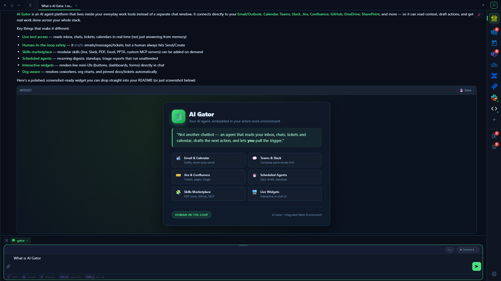

# AI Gator

An AI-powered productivity assistant that lives in your taskbar. Chat with your calendar, email, Teams, files, Confluence, Jira, GitHub, and more — all from one sidebar.



---

## Easy Install (Alpha Testers)

Published releases include self-contained desktop packages with Electron and the AI Gator backend bundled. Users do not need to install Electron, Node.js, or Python separately.

Download the package for your platform from the repository's **Releases** page:

- Windows: `AI-Gator-*-Windows-x64.exe`
- macOS Intel: `AI-Gator-*-macOS-x64.dmg`
- macOS Apple silicon: `AI-Gator-*-macOS-arm64.dmg`
- Linux: `AI-Gator-*-Linux-x64.AppImage` or the `.deb` package

The source installers below remain available for development and alpha troubleshooting.

Two ways to install from source — the one-liner is fastest (no manual download or unzip).

### Option 1 — One-line install (recommended)

Open a terminal and paste one line. It fetches the latest version and starts the app. Because it runs the script directly from the web, there's nothing to unblock.

<details open>
<summary><b>PowerShell</b></summary>

```powershell
irm https://raw.githubusercontent.com/mkflyamd/aigator-releases/main/Get-AIGator.ps1 | iex
```
</details>

<details>
<summary><b>Command Prompt / Windows Terminal</b></summary>

```bat
powershell -NoProfile -ExecutionPolicy Bypass -Command "irm https://raw.githubusercontent.com/mkflyamd/aigator-releases/main/Get-AIGator.ps1 | iex"
```
</details>

<details>
<summary><b>Linux (Terminal)</b></summary>

Install these prerequisites with your distribution's package manager: Python 3.12 or newer, the Python venv module, `curl`, `unzip`, and `tar`. Electron also needs the standard desktop libraries provided by a normal Ubuntu, Fedora, or Arch desktop installation.

```bash
curl -fsSL https://raw.githubusercontent.com/mkflyamd/aigator-releases/main/Get-AIGator.sh | bash
```

This installs AI Gator under `${XDG_DATA_HOME:-$HOME/.local/share}/AIGator`, downloads portable Node.js and Electron runtimes, creates an isolated Python environment, and opens the Electron app. To launch it later:

```bash
${XDG_DATA_HOME:-$HOME/.local/share}/AIGator/start-aigator.sh
```

For a native desktop-menu installation, prefer the release `.deb`. The source installer does not install a system service or desktop-menu entry.
</details>

<details>
<summary><b>macOS (Terminal)</b></summary>

```bash
curl -fsSL https://raw.githubusercontent.com/mkflyamd/aigator-releases/main/Get-AIGator.sh | bash
```

Installs Python 3.12 via Homebrew if needed, sets up the app in `~/Applications/AIGator`, downloads portable Node.js and Electron runtimes, and opens the Electron app. To open it again later, double-click **`start.command`** in that folder.
</details>

### Option 2 — Download and run

If you'd rather grab the files yourself:

**1. Download the app** — Go to the [project page](https://github.com/mkflyamd/aigator-releases), click the green **Code** button, then **Download ZIP**. Right-click the ZIP and choose **Extract All**.

**2. Run the setup script** — Open a terminal in the extracted folder and use the command for your platform:

<details open>
<summary><b>PowerShell</b></summary>

```powershell
Unblock-File .\WakeGator.ps1; .\WakeGator.ps1
```
</details>

<details>
<summary><b>Command Prompt / Windows Terminal</b></summary>

```bat
powershell -NoProfile -ExecutionPolicy Bypass -Command "Unblock-File '.\WakeGator.ps1'; & '.\WakeGator.ps1'"
```
</details>

<details>
<summary><b>Linux / macOS</b></summary>

```bash
bash WakeGator.sh
```
</details>

> **Prefer clicking on Windows?** Right-click **`WakeGator.ps1`** → **Run with PowerShell**. If it's blocked or closes instantly, use the command above instead — some machines don't show the Properties → Unblock option, and corporate Group Policy ignores `-ExecutionPolicy Bypass` on its own. The `Unblock-File` in the command is what actually clears the block.

---

Either way, the setup downloads the required runtimes, installs Python dependencies in an isolated environment, and opens AI Gator as an Electron desktop app. Windows also adds Start Menu, desktop, and login-startup shortcuts when selected. Linux and macOS use the relaunch scripts described above.

You'll need an API key to chat — see [Configuration](#configuration) below.

---

## Quick Start (Developers)

**Requirements:** Python 3.12+, Node.js 22+, and Windows 10/11, macOS, or a Linux desktop.

```bash
git clone https://github.com/mkflyamd/aigator-releases.git
cd aigator-releases
python3.12 -m venv .venv
.venv/bin/python -m pip install -r web/requirements.txt
npm install --prefix shell
```

On Windows, create the environment with `py -3.12 -m venv .venv` and use `.venv\Scripts\python.exe`.

- Windows development: `.\launch-dev.ps1`
- macOS/Linux development: run uvicorn and the Electron shell in separate terminals.
- Local native packages: build the PyInstaller backend sidecar, then run electron-builder for the current operating system.

See [docs/BUILD_INSTRUCTIONS.md](docs/BUILD_INSTRUCTIONS.md) for complete cross-platform development, local packaging, smoke-test, signing, and release instructions. Configure the gateway using [docs/gateway-setup.md](docs/gateway-setup.md).

---

## Features

- **Chat with your tools** — Outlook, Teams, Calendar, OneDrive, OneNote, SharePoint, Confluence, Jira, GitHub, Slack
- **Skill marketplace** — install community skills from any git repo
- **Browser agent** — automate web tasks via natural language
- **MCP support** — connect any Model Context Protocol server
- **Multi-tab** — run parallel conversations pinned to different contexts
- **Scheduler** — set up recurring tasks and reminders

---

## Configuration

See [docs/gateway-setup.md](docs/gateway-setup.md) for gateway configuration — direct Anthropic or corporate LLM proxy.

See [GETTING_STARTED.md](GETTING_STARTED.md) for full setup walkthrough.

---

## Enterprise Deployment

AI Gator works with any corporate LLM gateway that proxies the Anthropic API. Configure in `~/.config/teamspoc/config.json`:

```json
{
  "api_key": "your-gateway-key",
  "llm_gateway_url": "https://llm.your-company.com/Anthropic",
  "llm_gateway_key_header": "Ocp-Apim-Subscription-Key",
  "llm_gateway_user_field": "user",
  "gateway_user_id": "your-user-id"
}
```

M365 integration requires an Azure AD app registration with the permissions listed in [GETTING_STARTED.md](GETTING_STARTED.md).

Desktop packages are built for Windows, macOS, and Linux when a GitHub release is published. See [BUILD_INSTRUCTIONS.md](BUILD_INSTRUCTIONS.md).

---

## Contributing

See [CONTRIBUTING.md](CONTRIBUTING.md).

---

## License

Apache 2.0 — see [LICENSE](LICENSE).
